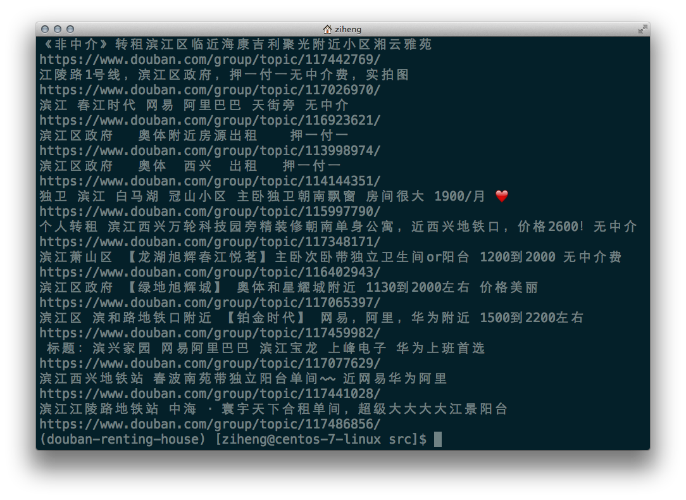

# Douban Renting House Tool

[](https://travis-ci.org/zihengCat/douban-renting-house-tool)

一款房源信息（豆瓣租房小组）筛选爬虫工具，为来大城市打拼的年轻人们提高租房信息筛选效率。

# Usage（使用说明）

1. 本机安装`Python3`环境。
2. `git clone`获取项目源码。
3. `pip3 install -r requirements.txt`安装项目依赖（也可使用**Python虚拟环境**）。
4. `python3 douban_renting_house.py`启动工具，查看帮助文档并使用此工具。

# Example（实例讲解）

从**豆瓣杭州租房小组**中抓取**前`1000`条**房源信息，以关键词`滨江`进行过滤筛选。

```
$ python3 douban_renting_house.py -r 'hangzhou' -s '滨江' -l 1000
```
> 代码清单：工具命令行使用实例

筛选结果默认以标准输出（`stdout`）的方式打印到屏幕，可以使用输出流重定向`>>`到任一文本文件中。



> 图：命令输出结果

# Dependences（项目依赖）

- [Requests](https://github.com/requests/requests)

- [BeautifulSoup4](https://www.crummy.com/software/BeautifulSoup/)

# License（许可协议）

[MIT](./LICENSE)

